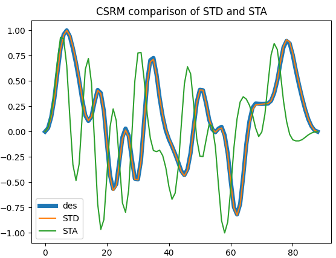

# Spike-Triggered-Descent (STD)
This is a neuron characterization technique similar in function to Spike-Triggered Average (STA).

## Demo
Run with: python3 demo.py

The result will look like this:

CSRM stands for the [Cumulative Spike Response Model](http://www.scholarpedia.org/article/Spike-response_model#Cumulative_Spike_Response_Model:_bursting_and_adaptation)

## License
CC-NC-BY, If you use this in an academic work cite:
https://arxiv.org/abs/2005.05572
